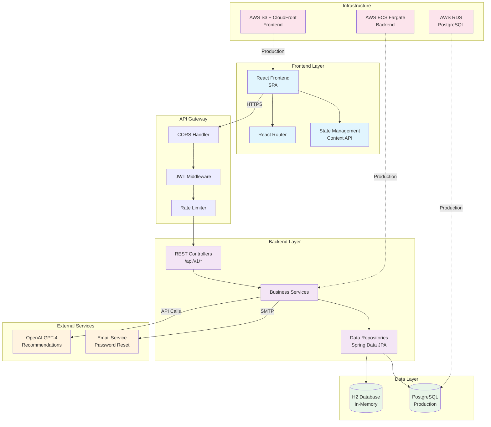

# Design Document
## Book Review Platform

**Version:** 0.1.0  
**Date:** December 2024  
**Project:** book-review-platform  

---

## Architecture Overview

The Book Review Platform follows a modern **3-tier architecture** with clear separation of concerns:

### High-Level Architecture
- **Presentation Layer:** React frontend (Single Page Application)
- **Application Layer:** Spring Boot REST API backend
- **Data Layer:** H2 in-memory database (development) / PostgreSQL (production)

### Key Architectural Principles
- **Stateless Backend:** JWT-based authentication enables horizontal scaling
- **RESTful API Design:** Standard HTTP methods and resource-based URLs
- **Layered Architecture:** Clear separation between controllers, services, and repositories
- **Dependency Injection:** Spring Framework's IoC container for loose coupling
- **Event-Driven Design:** Asynchronous processing for recommendations and analytics

---

## System Architecture Diagram



---

## Component Architecture

### Backend Component Diagram

```mermaid
graph TD
    subgraph "Presentation Layer"
        AuthController[AuthController]
        BookController[BookController]
        ReviewController[ReviewController]
        UserController[UserController]
        RecommendationController[RecommendationController]
    end
    
    subgraph "Service Layer"
        AuthService[AuthService]
        BookService[BookService]
        ReviewService[ReviewService]
        UserService[UserService]
        RecommendationService[RecommendationService]
        EmailService[EmailService]
        JwtService[JwtService]
    end
    
    subgraph "Repository Layer"
        UserRepository[UserRepository]
        BookRepository[BookRepository]
        ReviewRepository[ReviewRepository]
        RecommendationRepository[RecommendationRepository]
    end
    
    subgraph "Security Layer"
        JwtAuthFilter[JwtAuthenticationFilter]
        SecurityConfig[SecurityConfiguration]
        PasswordEncoder[PasswordEncoder]
    end
    
    subgraph "External Integrations"
        OpenAIClient[OpenAI Client]
        EmailProvider[Email Provider]
    end
    
    AuthController --> AuthService
    BookController --> BookService
    ReviewController --> ReviewService
    UserController --> UserService
    RecommendationController --> RecommendationService
    
    AuthService --> UserRepository
    AuthService --> JwtService
    AuthService --> EmailService
    BookService --> BookRepository
    ReviewService --> ReviewRepository
    ReviewService --> BookService
    UserService --> UserRepository
    RecommendationService --> RecommendationRepository
    RecommendationService --> OpenAIClient
    RecommendationService --> BookService
    EmailService --> EmailProvider
    
    JwtAuthFilter --> JwtService
    JwtAuthFilter --> UserService
    
    classDef controller fill:#e3f2fd
    classDef service fill:#f1f8e9
    classDef repository fill:#fef7e0
    classDef security fill:#fce4ec
    classDef external fill:#f3e5f5
    
    class AuthController,BookController,ReviewController,UserController,RecommendationController controller
    class AuthService,BookService,ReviewService,UserService,RecommendationService,EmailService,JwtService service
    class UserRepository,BookRepository,ReviewRepository,RecommendationRepository repository
    class JwtAuthFilter,SecurityConfig,PasswordEncoder security
    class OpenAIClient,EmailProvider external
```



---

## Module Breakdown

### 1. Authentication Module

**Package:** `com.bookreview.auth`

**Components:**
- `AuthController`: REST endpoints for login, register, logout, password reset
- `AuthService`: Business logic for user authentication and authorization
- `JwtService`: JWT token generation, validation, and management
- `SecurityConfig`: Spring Security configuration
- `JwtAuthenticationFilter`: Custom filter for JWT token processing

**Key Features:**
- User registration with email validation
- JWT-based stateless authentication
- Password encryption using BCrypt
- Token refresh mechanism
- Password reset via email

### 2. Book Module

**Package:** `com.bookreview.book`

**Components:**
- `BookController`: REST endpoints for book CRUD operations
- `BookService`: Business logic for book management
- `BookRepository`: Data access layer for books
- `Book`: Entity class representing book data
- `BookDTO`: Data transfer objects for API responses

**Key Features:**
- Complete book catalog management
- Advanced search and filtering capabilities
- Book metadata management (title, author, genre, etc.)
- Pagination and sorting
- Average rating calculation integration

### 3. Review Module

**Package:** `com.bookreview.review`

**Components:**
- `ReviewController`: REST endpoints for review CRUD operations
- `ReviewService`: Business logic for review management
- `ReviewRepository`: Data access layer for reviews
- `Review`: Entity class representing review data
- `ReviewDTO`: Data transfer objects for API responses
- `RatingCalculationService`: Service for calculating average ratings

**Key Features:**
- Full CRUD operations for reviews
- Star rating system (1-5 scale)
- Review validation and content moderation
- Average rating calculation and updates
- User authorization for review modifications

### 4. User Profile Module

**Package:** `com.bookreview.user`

**Components:**
- `UserController`: REST endpoints for user profile management
- `UserService`: Business logic for user operations
- `UserRepository`: Data access layer for users
- `User`: Entity class representing user data
- `UserDTO`: Data transfer objects for API responses
- `UserPreferencesService`: Service for managing user preferences

**Key Features:**
- User profile creation and management
- Reading history tracking
- Favorite books management
- User preferences for recommendations
- Privacy settings for profile visibility

### 5. Recommendation Service Module

**Package:** `com.bookreview.recommendation`

**Components:**
- `RecommendationController`: REST endpoints for recommendation requests
- `RecommendationService`: Core recommendation logic coordinator
- `TopRatedStrategy`: Implementation for top-rated books strategy
- `GenreSimilarityStrategy`: Implementation for genre-based recommendations
- `FavoritesSimilarityStrategy`: Implementation for favorites-based recommendations
- `OpenAIRecommendationStrategy`: Integration with OpenAI GPT-4
- `RecommendationRepository`: Caching layer for recommendations

**Key Features:**
- Multiple recommendation strategies
- AI-powered recommendations using OpenAI GPT-4
- Fallback mechanisms for service failures
- Recommendation result caching
- Personalization based on user behavior

---

## Data Models

### User Entity

```java
@Entity
@Table(name = "users")
public class User {
    @Id
    @GeneratedValue(strategy = GenerationType.IDENTITY)
    private Long id;
    
    @Column(unique = true, nullable = false)
    private String email;
    
    @Column(nullable = false)
    private String password;
    
    @Column(nullable = false)
    private String firstName;
    
    @Column(nullable = false)
    private String lastName;
    
    private String bio;
    
    @Enumerated(EnumType.STRING)
    private UserRole role; // USER, ADMIN
    
    @ElementCollection
    @Enumerated(EnumType.STRING)
    private Set<Genre> preferredGenres;
    
    @CreationTimestamp
    private LocalDateTime createdAt;
    
    @UpdateTimestamp
    private LocalDateTime updatedAt;
    
    @OneToMany(mappedBy = "user", cascade = CascadeType.ALL)
    private List<Review> reviews;
    
    @ManyToMany
    @JoinTable(name = "user_favorite_books")
    private Set<Book> favoriteBooks;
}
```

### Book Entity

```java
@Entity
@Table(name = "books")
public class Book {
    @Id
    @GeneratedValue(strategy = GenerationType.IDENTITY)
    private Long id;
    
    @Column(nullable = false)
    private String title;
    
    @Column(nullable = false)
    private String author;
    
    @Column(unique = true, nullable = false)
    private String isbn;
    
    @Enumerated(EnumType.STRING)
    private Genre genre;
    
    @Column(length = 2000)
    private String description;
    
    private LocalDate publicationDate;
    
    private String coverImageUrl;
    
    private Integer pageCount;
    
    private String publisher;
    
    @Column(precision = 3, scale = 2)
    private BigDecimal averageRating;
    
    private Integer totalReviews;
    
    @CreationTimestamp
    private LocalDateTime createdAt;
    
    @UpdateTimestamp
    private LocalDateTime updatedAt;
    
    @OneToMany(mappedBy = "book", cascade = CascadeType.ALL)
    private List<Review> reviews;
}
```

### Review Entity

```java
@Entity
@Table(name = "reviews")
public class Review {
    @Id
    @GeneratedValue(strategy = GenerationType.IDENTITY)
    private Long id;
    
    @ManyToOne(fetch = FetchType.LAZY)
    @JoinColumn(name = "user_id", nullable = false)
    private User user;
    
    @ManyToOne(fetch = FetchType.LAZY)
    @JoinColumn(name = "book_id", nullable = false)
    private Book book;
    
    @Column(nullable = false)
    @Min(1) @Max(5)
    private Integer rating;
    
    @Column(length = 5000)
    private String content;
    
    private String title;
    
    @CreationTimestamp
    private LocalDateTime createdAt;
    
    @UpdateTimestamp
    private LocalDateTime updatedAt;
    
    @Column(nullable = false)
    private Boolean isPublic = true;
}
```

### Recommendation Entity

```java
@Entity
@Table(name = "recommendations")
public class Recommendation {
    @Id
    @GeneratedValue(strategy = GenerationType.IDENTITY)
    private Long id;
    
    @ManyToOne(fetch = FetchType.LAZY)
    @JoinColumn(name = "user_id", nullable = false)
    private User user;
    
    @ManyToOne(fetch = FetchType.LAZY)
    @JoinColumn(name = "book_id", nullable = false)
    private Book book;
    
    @Enumerated(EnumType.STRING)
    private RecommendationStrategy strategy;
    
    @Column(precision = 5, scale = 4)
    private BigDecimal confidence;
    
    private String reasoning;
    
    @CreationTimestamp
    private LocalDateTime createdAt;
    
    private LocalDateTime expiresAt;
}
```

### Supporting Enums

```java
public enum Genre {
    FICTION, NON_FICTION, MYSTERY, ROMANCE, SCIENCE_FICTION, 
    FANTASY, BIOGRAPHY, HISTORY, SELF_HELP, BUSINESS, 
    TECHNOLOGY, HEALTH, COOKING, TRAVEL, CHILDREN
}

public enum UserRole {
    USER, ADMIN
}

public enum RecommendationStrategy {
    TOP_RATED, GENRE_SIMILARITY, FAVORITES_SIMILARITY, AI_POWERED
}
```

---

## API Endpoints

### Authentication Endpoints

#### POST /api/v1/auth/register
**Description:** Register a new user account

**Request Body:**
```json
{
  "email": "user@example.com",
  "password": "SecurePassword123!",
  "firstName": "John",
  "lastName": "Doe",
  "bio": "Book enthusiast and avid reader",
  "preferredGenres": ["FICTION", "MYSTERY"]
}
```

**Response (201 Created):**
```json
{
  "id": 1,
  "email": "user@example.com",
  "firstName": "John",
  "lastName": "Doe",
  "bio": "Book enthusiast and avid reader",
  "preferredGenres": ["FICTION", "MYSTERY"],
  "createdAt": "2024-12-15T10:30:00Z",
  "accessToken": "eyJhbGciOiJIUzI1NiIsInR5cCI6IkpXVCJ9...",
  "refreshToken": "eyJhbGciOiJIUzI1NiIsInR5cCI6IkpXVCJ9...",
  "tokenType": "Bearer",
  "expiresIn": 3600
}
```

#### POST /api/v1/auth/login
**Description:** Authenticate user and return JWT tokens

**Request Body:**
```json
{
  "email": "user@example.com",
  "password": "SecurePassword123!"
}
```

**Response (200 OK):**
```json
{
  "user": {
    "id": 1,
    "email": "user@example.com",
    "firstName": "John",
    "lastName": "Doe",
    "bio": "Book enthusiast and avid reader",
    "preferredGenres": ["FICTION", "MYSTERY"]
  },
  "accessToken": "eyJhbGciOiJIUzI1NiIsInR5cCI6IkpXVCJ9...",
  "refreshToken": "eyJhbGciOiJIUzI1NiIsInR5cCI6IkpXVCJ9...",
  "tokenType": "Bearer",
  "expiresIn": 3600
}
```

#### POST /api/v1/auth/refresh
**Description:** Refresh access token using refresh token

**Request Body:**
```json
{
  "refreshToken": "eyJhbGciOiJIUzI1NiIsInR5cCI6IkpXVCJ9..."
}
```

#### POST /api/v1/auth/logout
**Description:** Logout user and invalidate tokens
**Headers:** `Authorization: Bearer {token}`

#### POST /api/v1/auth/forgot-password
**Description:** Send password reset email

**Request Body:**
```json
{
  "email": "user@example.com"
}
```

### Book Endpoints

#### GET /api/v1/books
**Description:** Get paginated list of books with filtering and sorting

**Query Parameters:**
- `page` (default: 0)
- `size` (default: 20)
- `sort` (default: "title") - title, author, averageRating, publicationDate
- `direction` (default: "asc") - asc, desc
- `genre` - filter by genre
- `author` - filter by author name
- `search` - search in title and description
- `minRating` - minimum average rating
- `maxRating` - maximum average rating

**Response (200 OK):**
```json
{
  "content": [
    {
      "id": 1,
      "title": "The Great Gatsby",
      "author": "F. Scott Fitzgerald",
      "isbn": "978-0-7432-7356-5",
      "genre": "FICTION",
      "description": "A classic American novel...",
      "publicationDate": "1925-04-10",
      "coverImageUrl": "https://example.com/covers/gatsby.jpg",
      "pageCount": 180,
      "publisher": "Scribner",
      "averageRating": 4.2,
      "totalReviews": 1250,
      "createdAt": "2024-12-15T10:30:00Z"
    }
  ],
  "pageable": {
    "page": 0,
    "size": 20,
    "sort": "title,asc"
  },
  "totalElements": 1000,
  "totalPages": 50,
  "first": true,
  "last": false
}
```

#### GET /api/v1/books/{id}
**Description:** Get detailed information about a specific book

**Response (200 OK):**
```json
{
  "id": 1,
  "title": "The Great Gatsby",
  "author": "F. Scott Fitzgerald",
  "isbn": "978-0-7432-7356-5",
  "genre": "FICTION",
  "description": "A classic American novel set in the summer of 1922...",
  "publicationDate": "1925-04-10",
  "coverImageUrl": "https://example.com/covers/gatsby.jpg",
  "pageCount": 180,
  "publisher": "Scribner",
  "averageRating": 4.2,
  "totalReviews": 1250,
  "createdAt": "2024-12-15T10:30:00Z",
  "recentReviews": [
    {
      "id": 101,
      "user": {
        "id": 2,
        "firstName": "Jane",
        "lastName": "Smith"
      },
      "rating": 5,
      "title": "Masterpiece of American Literature",
      "content": "Fitzgerald's prose is simply stunning...",
      "createdAt": "2024-12-14T15:20:00Z"
    }
  ]
}
```

#### POST /api/v1/books
**Description:** Create a new book (Admin only)
**Headers:** `Authorization: Bearer {token}`

**Request Body:**
```json
{
  "title": "New Book Title",
  "author": "Author Name",
  "isbn": "978-0-123456-78-9",
  "genre": "FICTION",
  "description": "Book description...",
  "publicationDate": "2024-01-15",
  "coverImageUrl": "https://example.com/covers/new-book.jpg",
  "pageCount": 300,
  "publisher": "Publisher Name"
}
```

#### PUT /api/v1/books/{id}
**Description:** Update an existing book (Admin only)
**Headers:** `Authorization: Bearer {token}`

#### DELETE /api/v1/books/{id}
**Description:** Delete a book (Admin only)
**Headers:** `Authorization: Bearer {token}`

### Review Endpoints

#### GET /api/v1/reviews
**Description:** Get paginated list of reviews with filtering

**Query Parameters:**
- `page` (default: 0)
- `size` (default: 20)
- `sort` (default: "createdAt") - createdAt, rating
- `direction` (default: "desc")
- `bookId` - filter by book ID
- `userId` - filter by user ID
- `minRating` - minimum rating
- `maxRating` - maximum rating

#### GET /api/v1/reviews/{id}
**Description:** Get detailed information about a specific review

#### POST /api/v1/reviews
**Description:** Create a new review
**Headers:** `Authorization: Bearer {token}`

**Request Body:**
```json
{
  "bookId": 1,
  "rating": 5,
  "title": "Excellent Read!",
  "content": "This book was absolutely fantastic. The character development was superb and the plot kept me engaged throughout...",
  "isPublic": true
}
```

**Response (201 Created):**
```json
{
  "id": 101,
  "user": {
    "id": 1,
    "firstName": "John",
    "lastName": "Doe"
  },
  "book": {
    "id": 1,
    "title": "The Great Gatsby",
    "author": "F. Scott Fitzgerald"
  },
  "rating": 5,
  "title": "Excellent Read!",
  "content": "This book was absolutely fantastic...",
  "isPublic": true,
  "createdAt": "2024-12-15T10:30:00Z",
  "updatedAt": "2024-12-15T10:30:00Z"
}
```

#### PUT /api/v1/reviews/{id}
**Description:** Update an existing review (owner only)
**Headers:** `Authorization: Bearer {token}`

#### DELETE /api/v1/reviews/{id}
**Description:** Delete a review (owner or admin only)
**Headers:** `Authorization: Bearer {token}`

### User Profile Endpoints

#### GET /api/v1/users/profile
**Description:** Get current user's profile
**Headers:** `Authorization: Bearer {token}`

**Response (200 OK):**
```json
{
  "id": 1,
  "email": "user@example.com",
  "firstName": "John",
  "lastName": "Doe",
  "bio": "Book enthusiast and avid reader",
  "preferredGenres": ["FICTION", "MYSTERY"],
  "createdAt": "2024-12-15T10:30:00Z",
  "stats": {
    "totalReviews": 25,
    "averageRating": 4.1,
    "favoriteBooks": 12,
    "readingStreak": 30
  },
  "recentActivity": [
    {
      "type": "REVIEW_CREATED",
      "bookTitle": "The Great Gatsby",
      "timestamp": "2024-12-14T15:20:00Z"
    }
  ]
}
```

#### PUT /api/v1/users/profile
**Description:** Update current user's profile
**Headers:** `Authorization: Bearer {token}`

#### GET /api/v1/users/{id}/public-profile
**Description:** Get public profile of a user

#### GET /api/v1/users/favorites
**Description:** Get current user's favorite books
**Headers:** `Authorization: Bearer {token}`

#### POST /api/v1/users/favorites/{bookId}
**Description:** Add book to favorites
**Headers:** `Authorization: Bearer {token}`

#### DELETE /api/v1/users/favorites/{bookId}
**Description:** Remove book from favorites
**Headers:** `Authorization: Bearer {token}`

### Recommendation Endpoints

#### GET /api/v1/recommendations
**Description:** Get personalized book recommendations
**Headers:** `Authorization: Bearer {token}`

**Query Parameters:**
- `strategy` - TOP_RATED, GENRE_SIMILARITY, FAVORITES_SIMILARITY, AI_POWERED
- `limit` (default: 10)
- `genre` - filter recommendations by genre

**Response (200 OK):**
```json
{
  "recommendations": [
    {
      "book": {
        "id": 15,
        "title": "To Kill a Mockingbird",
        "author": "Harper Lee",
        "genre": "FICTION",
        "averageRating": 4.5,
        "coverImageUrl": "https://example.com/covers/mockingbird.jpg"
      },
      "strategy": "GENRE_SIMILARITY",
      "confidence": 0.8756,
      "reasoning": "Based on your love for classic American fiction and highly-rated books in the FICTION genre",
      "createdAt": "2024-12-15T10:30:00Z"
    }
  ],
  "strategy": "GENRE_SIMILARITY",
  "totalRecommendations": 50,
  "generatedAt": "2024-12-15T10:30:00Z"
}
```

#### POST /api/v1/recommendations/feedback
**Description:** Provide feedback on recommendation quality
**Headers:** `Authorization: Bearer {token}`

**Request Body:**
```json
{
  "recommendationId": 123,
  "feedback": "HELPFUL", // HELPFUL, NOT_HELPFUL, IRRELEVANT
  "comment": "Great recommendation, exactly what I was looking for!"
}
```

---

## Non-Functional Aspects

### Security Architecture

#### Authentication & Authorization
- **JWT-based Authentication:** Stateless tokens with configurable expiration
- **Role-based Access Control:** USER and ADMIN roles with different permissions
- **Password Security:** BCrypt hashing with salt rounds configuration
- **Input Validation:** Bean Validation (JSR-303) for all request DTOs
- **SQL Injection Prevention:** JPA/Hibernate parameterized queries
- **CORS Configuration:** Configurable allowed origins for frontend integration

#### API Security
- **Rate Limiting:** Configurable request limits per user/IP
- **Request Size Limits:** Maximum payload sizes for upload endpoints
- **Security Headers:** HSTS, X-Frame-Options, X-Content-Type-Options
- **API Versioning:** URL-based versioning (/api/v1/) for backward compatibility

### Performance & Scalability

#### Database Optimization
- **Indexing Strategy:** Optimized indexes on frequently queried columns
- **Connection Pooling:** HikariCP for efficient database connections
- **Query Optimization:** JPA query hints and custom queries for complex operations
- **Pagination:** Cursor-based pagination for large datasets

#### Caching Strategy
- **Application-level Caching:** Spring Cache abstraction with Redis
- **HTTP Caching:** ETags and Cache-Control headers for static content
- **Database Query Caching:** Second-level Hibernate cache for entities

#### Scalability Design
- **Stateless Architecture:** Horizontal scaling capability
- **Microservice-ready:** Modular design for future service decomposition
- **Load Balancer Support:** Session-independent request handling
- **Database Scaling:** Read replicas support for read-heavy operations

### Monitoring & Observability

#### Application Monitoring
- **Health Checks:** Spring Boot Actuator endpoints
- **Metrics Collection:** Micrometer integration with Prometheus
- **Distributed Tracing:** Spring Cloud Sleuth for request tracing
- **Custom Metrics:** Business metrics for recommendations and user engagement

#### Logging Strategy
- **Structured Logging:** JSON-formatted logs for parsing
- **Log Levels:** Configurable logging levels per package
- **Security Logging:** Authentication attempts and authorization failures
- **Performance Logging:** Slow query detection and API response times

### Error Handling & Resilience

#### Exception Management
- **Global Exception Handler:** Centralized error response formatting
- **Custom Exceptions:** Domain-specific exceptions with error codes
- **Error Response Schema:** Consistent error response structure
- **Validation Errors:** Field-level validation error details

#### Resilience Patterns
- **Circuit Breaker:** For external service calls (OpenAI API)
- **Retry Logic:** Configurable retry policies for transient failures
- **Timeout Configuration:** Request timeouts for external dependencies
- **Graceful Degradation:** Fallback mechanisms for recommendation service

---

## Technology Stack Justification

### Backend Technology Choices

#### Java 17
**Rationale:**
- **Long-term Support:** LTS version ensuring stability and security updates
- **Modern Language Features:** Records, pattern matching, and improved APIs
- **Performance:** Enhanced JVM performance and memory management
- **Ecosystem Maturity:** Extensive library ecosystem and community support
- **Enterprise Adoption:** Wide industry adoption and proven scalability

#### Spring Boot 3.x
**Rationale:**
- **Rapid Development:** Auto-configuration and starter dependencies
- **Production-ready Features:** Built-in monitoring, health checks, and metrics
- **Security Integration:** Comprehensive security framework integration
- **Testing Support:** Extensive testing utilities and annotations
- **Cloud-native Support:** Native image compilation and containerization
- **Community & Documentation:** Extensive documentation and community support

#### Gradle
**Rationale:**
- **Build Performance:** Incremental builds and build caching
- **Flexibility:** Groovy/Kotlin DSL for complex build logic
- **Dependency Management:** Superior dependency resolution and conflict handling
- **Plugin Ecosystem:** Rich plugin ecosystem for various tasks
- **Multi-project Support:** Excellent support for modular applications

#### JUnit 5 + Mockito
**Rationale:**
- **Modern Testing:** Lambda support and dynamic tests
- **Parameterized Tests:** Built-in support for data-driven testing
- **Extension Model:** Flexible extension mechanism for custom behavior
- **Mocking Capabilities:** Powerful mocking framework for unit tests
- **Spring Integration:** Seamless integration with Spring Test framework

### Database Technology

#### H2 Database (Development)
**Rationale:**
- **Zero Configuration:** Embedded database requiring no setup
- **Fast Development:** In-memory operation for rapid testing
- **SQL Compatibility:** Standard SQL support for PostgreSQL compatibility
- **Testing Benefits:** Clean state for each test execution
- **Development Productivity:** No external database dependencies

#### PostgreSQL (Production)
**Rationale:**
- **ACID Compliance:** Full transactional support for data integrity
- **Performance:** Excellent performance for read-heavy workloads
- **JSON Support:** Native JSON operations for flexible data storage
- **Scalability:** Read replicas and partitioning support
- **Open Source:** No licensing costs with enterprise features
- **AWS RDS Support:** Managed service integration for production deployment

### Supporting Technologies

#### Spring Data JPA
**Rationale:**
- **Repository Pattern:** Clean abstraction over data access
- **Query Generation:** Automatic query generation from method names
- **Custom Queries:** Support for complex custom queries
- **Auditing Support:** Built-in entity auditing capabilities
- **Transaction Management:** Declarative transaction support

#### Spring Security
**Rationale:**
- **Comprehensive Security:** Authentication, authorization, and protection against common attacks
- **JWT Integration:** Built-in support for token-based authentication
- **Method-level Security:** Fine-grained authorization control
- **CSRF Protection:** Built-in protection against cross-site request forgery
- **Security Headers:** Automatic security header configuration

#### Jackson (JSON Processing)
**Rationale:**
- **Performance:** Fast JSON serialization/deserialization
- **Spring Integration:** Default JSON processor for Spring Boot
- **Customization:** Extensive customization options for JSON mapping
- **Data Binding:** Strong data binding capabilities with validation

#### Bean Validation (JSR-303)
**Rationale:**
- **Declarative Validation:** Annotation-based validation rules
- **Integration:** Seamless integration with Spring MVC
- **Custom Validators:** Support for custom validation logic
- **Error Handling:** Automatic validation error response generation

---

## Development & Deployment Strategy

### Development Workflow
1. **Spec-driven Development:** Requirements → Design → Implementation
2. **Test-driven Development:** Write tests before implementation
3. **Code Reviews:** Mandatory peer review for all changes
4. **Continuous Integration:** Automated build, test, and quality checks
5. **Documentation:** Maintain up-to-date API and architecture documentation

### Quality Assurance
- **Unit Testing:** 80% minimum code coverage enforced
- **Integration Testing:** End-to-end API testing
- **Performance Testing:** Load testing for critical endpoints
- **Security Testing:** Static analysis and dependency vulnerability scanning
- **Code Quality:** SonarQube integration for code quality metrics

### Deployment Architecture
- **Containerization:** Docker containers for consistent deployment
- **Orchestration:** AWS ECS Fargate for container management
- **Infrastructure as Code:** Terraform for reproducible infrastructure
- **Blue-Green Deployment:** Zero-downtime deployment strategy
- **Environment Parity:** Consistent configuration across environments

---

*This design document provides the technical blueprint for implementing the Book Review Platform, ensuring scalable, secure, and maintainable architecture that aligns with the requirements specified in the PRD.*

