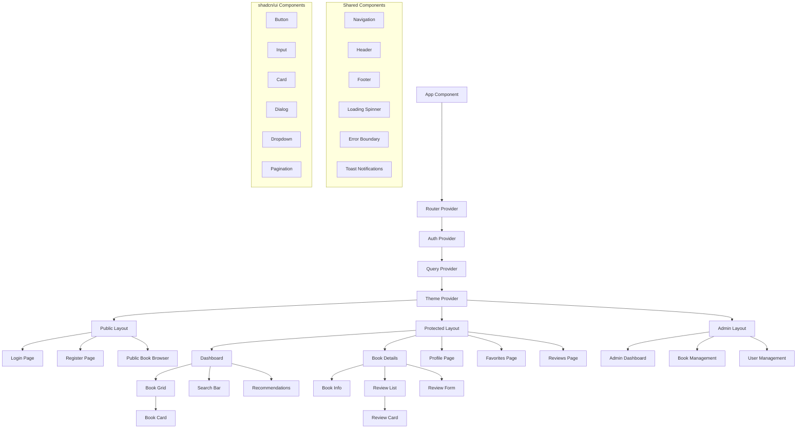

# Book Review Platform - Frontend High-Level Design

**Version**: 1.0  
**Date**: December 2024  
**Status**: Draft  

---

## 1. Architecture Overview

### 1.1 System Architecture

The Book Review Platform frontend is a Single Page Application (SPA) built with React 18+ and TypeScript, designed to consume RESTful APIs from the existing Spring Boot backend. The application follows a modern client-server architecture with JWT-based authentication and efficient state management.

```
┌─────────────────────────────────────────────────────────────┐
│                    Frontend (React SPA)                     │
├─────────────────────────────────────────────────────────────┤
│  UI Layer (React Components + TailwindCSS + shadcn/ui)     │
│  ├── Pages (Auth, Books, Reviews, Profile, Admin)          │
│  ├── Components (Reusable UI Components)                   │
│  └── Layouts (Main Layout, Auth Layout)                    │
├─────────────────────────────────────────────────────────────┤
│  State Management Layer                                     │
│  ├── React Query (Server State + Caching)                  │
│  ├── React Context (Auth State + Theme)                    │
│  └── React Hook Form (Form State)                          │
├─────────────────────────────────────────────────────────────┤
│  API Layer (HTTP Client + Interceptors)                    │
│  ├── Axios Client with JWT Interceptor                     │
│  ├── API Service Functions                                 │
│  └── Error Handling & Retry Logic                          │
├─────────────────────────────────────────────────────────────┤
│  Routing Layer (React Router)                              │
│  ├── Public Routes (Login, Register, Book Browse)          │
│  ├── Protected Routes (Profile, Reviews, Favorites)        │
│  └── Admin Routes (Book Management)                        │
└─────────────────────────────────────────────────────────────┘
                               │
                               │ HTTPS/REST API
                               │ JWT Authentication
                               ▼
┌─────────────────────────────────────────────────────────────┐
│                 Backend (Spring Boot)                       │
│  ├── REST Controllers (Books, Reviews, Auth, Users)        │
│  ├── JWT Security Filter                                   │
│  ├── Business Logic Services                               │
│  └── Database Layer (JPA + H2/PostgreSQL)                  │
└─────────────────────────────────────────────────────────────┘
```

### 1.2 Key Design Principles

- **Component-Based Architecture**: Modular, reusable components following atomic design
- **Separation of Concerns**: Clear separation between UI, state, and business logic
- **Performance-First**: Optimized for fast loading and smooth interactions
- **Accessibility-First**: WCAG 2.1 AA compliance from the ground up
- **Mobile-First**: Responsive design starting from mobile breakpoints
- **Type Safety**: Full TypeScript integration for better developer experience

---

## 2. Component Architecture Diagram



---

## 3. UI Module Breakdown

### 3.1 Authentication Module

**Components:**
- `LoginPage` - Email/password login form with validation
- `RegisterPage` - User registration form with terms acceptance
- `ForgotPasswordPage` - Password reset request form
- `ResetPasswordPage` - New password form with token validation
- `AuthGuard` - HOC for protecting routes
- `LoginForm` - Reusable login form component
- `RegisterForm` - Reusable registration form component

**Features:**
- Form validation with real-time feedback
- JWT token management with automatic refresh
- Remember me functionality
- Social login placeholders (future enhancement)
- Responsive design with mobile-optimized forms

### 3.2 Book Discovery Module

**Components:**
- `BookListPage` - Main book browsing page with grid layout
- `BookDetailsPage` - Detailed book information and reviews
- `BookGrid` - Responsive grid of book cards
- `BookCard` - Individual book display component
- `SearchBar` - Autocomplete search with filters
- `FilterPanel` - Advanced filtering options
- `BookCover` - Optimized image component with fallbacks

**Features:**
- Infinite scroll pagination
- Advanced search with autocomplete
- Filter by genre, rating, year, author
- Sort by popularity, rating, date
- Responsive grid (1-6 columns based on screen size)
- Image optimization with lazy loading

### 3.3 Book Details & Reviews Module

**Components:**
- `BookDetailsView` - Comprehensive book information display
- `ReviewSection` - Container for all review-related components
- `ReviewList` - Paginated list of reviews
- `ReviewCard` - Individual review display
- `ReviewForm` - Create/edit review form with rich text editor
- `RatingInput` - Interactive star rating component
- `RatingDisplay` - Read-only star rating display

**Features:**
- Rich text editor for reviews (future: Markdown support)
- Star rating system (1-5 stars)
- Review sorting and filtering
- Like/helpful voting on reviews (future)
- Review moderation for inappropriate content
- User avatar and profile links

### 3.4 User Profile Module

**Components:**
- `ProfilePage` - User profile dashboard
- `ProfileEditor` - Edit profile information form
- `FavoritesPage` - User's favorite books display
- `ReadingHistoryPage` - User's reviewed books
- `PreferencesPage` - Genre preferences and settings
- `UserStats` - Reading statistics and achievements
- `AvatarUpload` - Profile picture upload component

**Features:**
- Profile information management
- Reading statistics and progress
- Favorite books management
- Genre preferences for recommendations
- Reading goals and achievements (future)
- Privacy settings for profile visibility

### 3.5 Recommendations Module

**Components:**
- `RecommendationsPage` - Personalized recommendations dashboard
- `RecommendationsList` - List of recommended books
- `RecommendationCard` - Individual recommendation with reasoning
- `TopRatedBooks` - Highest-rated books section
- `TrendingBooks` - Currently popular books
- `GenreRecommendations` - Recommendations by preferred genres

**Features:**
- Personalized recommendations based on user behavior
- Multiple recommendation strategies (collaborative, content-based)
- Explanation for why books are recommended
- Feedback mechanism for improving recommendations
- Discovery of new genres and authors

### 3.6 Admin Module (Protected)

**Components:**
- `AdminDashboard` - Overview of platform statistics
- `BookManagement` - CRUD operations for books
- `UserManagement` - User administration
- `ReviewModeration` - Review approval and moderation
- `AnalyticsDashboard` - Usage analytics and insights
- `BookEditor` - Comprehensive book creation/editing form

**Features:**
- Book catalog management (add, edit, delete books)
- User management and role assignment
- Content moderation tools
- Platform analytics and reporting
- Bulk operations for book management

---

## 4. State Management Strategy

### 4.1 Server State Management (React Query)

```typescript
// Query Keys Factory
export const queryKeys = {
  books: {
    all: ['books'] as const,
    lists: () => [...queryKeys.books.all, 'list'] as const,
    list: (filters: BookFilters) => [...queryKeys.books.lists(), filters] as const,
    details: () => [...queryKeys.books.all, 'detail'] as const,
    detail: (id: string) => [...queryKeys.books.details(), id] as const,
  },
  reviews: {
    all: ['reviews'] as const,
    lists: () => [...queryKeys.reviews.all, 'list'] as const,
    list: (bookId: string) => [...queryKeys.reviews.lists(), bookId] as const,
  },
  user: {
    all: ['user'] as const,
    profile: () => [...queryKeys.user.all, 'profile'] as const,
    favorites: () => [...queryKeys.user.all, 'favorites'] as const,
  },
  recommendations: {
    all: ['recommendations'] as const,
    personalized: () => [...queryKeys.recommendations.all, 'personalized'] as const,
    topRated: () => [...queryKeys.recommendations.all, 'topRated'] as const,
  },
}

// React Query Configuration
export const queryClient = new QueryClient({
  defaultOptions: {
    queries: {
      staleTime: 5 * 60 * 1000, // 5 minutes
      cacheTime: 10 * 60 * 1000, // 10 minutes
      retry: 2,
      refetchOnWindowFocus: false,
    },
    mutations: {
      retry: 1,
    },
  },
})
```

**Benefits:**
- Automatic caching and background updates
- Optimistic updates for better UX
- Request deduplication and batching
- Error handling and retry logic
- Loading and error states management

### 4.2 Client State Management (React Context)

```typescript
// Auth Context
interface AuthState {
  user: User | null
  token: string | null
  isAuthenticated: boolean
  isLoading: boolean
}

// Theme Context
interface ThemeState {
  theme: 'light' | 'dark' | 'system'
  setTheme: (theme: ThemeState['theme']) => void
}

// UI Context
interface UIState {
  sidebarOpen: boolean
  setSidebarOpen: (open: boolean) => void
  notifications: Notification[]
  addNotification: (notification: Notification) => void
}
```

**Context Providers:**
- `AuthProvider` - Authentication state and methods
- `ThemeProvider` - Theme management and persistence
- `UIProvider` - Global UI state (modals, notifications, etc.)

### 4.3 Form State Management (React Hook Form)

```typescript
// Form validation with Zod
const loginSchema = z.object({
  email: z.string().email('Invalid email address'),
  password: z.string().min(6, 'Password must be at least 6 characters'),
  rememberMe: z.boolean().optional(),
})

// Form hook with validation
const useLoginForm = () => {
  return useForm<LoginFormData>({
    resolver: zodResolver(loginSchema),
    defaultValues: {
      email: '',
      password: '',
      rememberMe: false,
    },
  })
}
```

---

## 5. Routing Architecture

### 5.1 Route Structure

```typescript
// Route Configuration
const router = createBrowserRouter([
  {
    path: '/',
    element: <PublicLayout />,
    children: [
      { index: true, element: <HomePage /> },
      { path: 'login', element: <LoginPage /> },
      { path: 'register', element: <RegisterPage /> },
      { path: 'books', element: <BookListPage /> },
      { path: 'books/:id', element: <BookDetailsPage /> },
      { path: 'forgot-password', element: <ForgotPasswordPage /> },
      { path: 'reset-password', element: <ResetPasswordPage /> },
    ],
  },
  {
    path: '/app',
    element: <ProtectedRoute><AppLayout /></ProtectedRoute>,
    children: [
      { index: true, element: <DashboardPage /> },
      { path: 'profile', element: <ProfilePage /> },
      { path: 'favorites', element: <FavoritesPage /> },
      { path: 'reviews', element: <ReviewsPage /> },
      { path: 'recommendations', element: <RecommendationsPage /> },
    ],
  },
  {
    path: '/admin',
    element: <AdminRoute><AdminLayout /></AdminRoute>,
    children: [
      { index: true, element: <AdminDashboard /> },
      { path: 'books', element: <BookManagement /> },
      { path: 'users', element: <UserManagement /> },
      { path: 'reviews', element: <ReviewModeration /> },
    ],
  },
])
```

### 5.2 Route Guards

```typescript
// Protected Route Component
const ProtectedRoute: React.FC<{ children: React.ReactNode }> = ({ children }) => {
  const { isAuthenticated, isLoading } = useAuth()
  const location = useLocation()

  if (isLoading) {
    return <LoadingSpinner />
  }

  if (!isAuthenticated) {
    return <Navigate to="/login" state={{ from: location }} replace />
  }

  return <>{children}</>
}

// Admin Route Component
const AdminRoute: React.FC<{ children: React.ReactNode }> = ({ children }) => {
  const { user } = useAuth()

  if (user?.role !== 'ADMIN') {
    return <Navigate to="/app" replace />
  }

  return <>{children}</>
}
```

---

## 6. API Layer Architecture

### 6.1 HTTP Client Configuration

```typescript
// Axios instance with interceptors
const apiClient = axios.create({
  baseURL: import.meta.env.VITE_API_BASE_URL || 'http://localhost:8080/api/v1',
  timeout: 10000,
  headers: {
    'Content-Type': 'application/json',
  },
})

// Request interceptor for JWT token
apiClient.interceptors.request.use(
  (config) => {
    const token = localStorage.getItem('authToken')
    if (token) {
      config.headers.Authorization = `Bearer ${token}`
    }
    return config
  },
  (error) => Promise.reject(error)
)

// Response interceptor for token refresh
apiClient.interceptors.response.use(
  (response) => response,
  async (error) => {
    const originalRequest = error.config
    
    if (error.response?.status === 401 && !originalRequest._retry) {
      originalRequest._retry = true
      
      try {
        const refreshToken = localStorage.getItem('refreshToken')
        const response = await refreshAuthToken(refreshToken)
        
        localStorage.setItem('authToken', response.data.accessToken)
        originalRequest.headers.Authorization = `Bearer ${response.data.accessToken}`
        
        return apiClient(originalRequest)
      } catch (refreshError) {
        // Redirect to login
        window.location.href = '/login'
        return Promise.reject(refreshError)
      }
    }
    
    return Promise.reject(error)
  }
)
```

### 6.2 API Service Layer

```typescript
// API Service Functions
export const booksApi = {
  getBooks: (params?: BookFilters): Promise<PaginatedResponse<Book>> =>
    apiClient.get('/books', { params }),
    
  getBook: (id: string): Promise<Book> =>
    apiClient.get(`/books/${id}`).then(res => res.data),
    
  createBook: (book: CreateBookRequest): Promise<Book> =>
    apiClient.post('/books', book).then(res => res.data),
    
  updateBook: (id: string, book: UpdateBookRequest): Promise<Book> =>
    apiClient.put(`/books/${id}`, book).then(res => res.data),
    
  deleteBook: (id: string): Promise<void> =>
    apiClient.delete(`/books/${id}`),
    
  searchBooks: (query: string): Promise<Book[]> =>
    apiClient.get('/books/search', { params: { q: query } }).then(res => res.data),
}

export const reviewsApi = {
  getReviews: (bookId: string, params?: PaginationParams): Promise<PaginatedResponse<Review>> =>
    apiClient.get(`/books/${bookId}/reviews`, { params }),
    
  createReview: (review: CreateReviewRequest): Promise<Review> =>
    apiClient.post('/reviews', review).then(res => res.data),
    
  updateReview: (id: string, review: UpdateReviewRequest): Promise<Review> =>
    apiClient.put(`/reviews/${id}`, review).then(res => res.data),
    
  deleteReview: (id: string): Promise<void> =>
    apiClient.delete(`/reviews/${id}`),
}
```

### 6.3 Custom Hooks for API Integration

```typescript
// Books Hooks
export const useBooks = (filters?: BookFilters) => {
  return useQuery({
    queryKey: queryKeys.books.list(filters || {}),
    queryFn: () => booksApi.getBooks(filters),
    keepPreviousData: true,
  })
}

export const useBook = (id: string) => {
  return useQuery({
    queryKey: queryKeys.books.detail(id),
    queryFn: () => booksApi.getBook(id),
    enabled: !!id,
  })
}

export const useCreateBook = () => {
  const queryClient = useQueryClient()
  
  return useMutation({
    mutationFn: booksApi.createBook,
    onSuccess: () => {
      queryClient.invalidateQueries({ queryKey: queryKeys.books.all })
      toast.success('Book created successfully!')
    },
    onError: (error) => {
      toast.error('Failed to create book')
    },
  })
}
```

---

## 7. Non-Functional Design Aspects

### 7.1 Performance Optimization

**Code Splitting:**
```typescript
// Lazy loading for better performance
const BookDetailsPage = lazy(() => import('./pages/BookDetailsPage'))
const ProfilePage = lazy(() => import('./pages/ProfilePage'))
const AdminDashboard = lazy(() => import('./pages/AdminDashboard'))

// Suspense wrapper for lazy components
<Suspense fallback={<PageLoadingSpinner />}>
  <Routes>
    <Route path="/book/:id" element={<BookDetailsPage />} />
  </Routes>
</Suspense>
```

**Image Optimization:**
```typescript
// Optimized image component
const OptimizedImage: React.FC<ImageProps> = ({ src, alt, ...props }) => {
  const [imageSrc, setImageSrc] = useState(placeholderImage)
  
  useEffect(() => {
    const img = new Image()
    img.onload = () => setImageSrc(src)
    img.src = src
  }, [src])
  
  return (
    
  )
}
```

**Bundle Optimization:**
- Tree shaking for unused code elimination
- Bundle analysis with webpack-bundle-analyzer
- Dynamic imports for feature-based splitting
- Service worker for caching (future enhancement)

### 7.2 Error Handling Strategy

```typescript
// Error Boundary
class ErrorBoundary extends React.Component<ErrorBoundaryProps, ErrorBoundaryState> {
  constructor(props: ErrorBoundaryProps) {
    super(props)
    this.state = { hasError: false, error: null }
  }

  static getDerivedStateFromError(error: Error): ErrorBoundaryState {
    return { hasError: true, error }
  }

  componentDidCatch(error: Error, errorInfo: ErrorInfo) {
    // Log error to monitoring service
    console.error('Error caught by boundary:', error, errorInfo)
  }

  render() {
    if (this.state.hasError) {
      return <ErrorFallback error={this.state.error} />
    }

    return this.props.children
  }
}

// Global error handler
const useGlobalErrorHandler = () => {
  const { addNotification } = useUI()
  
  const handleError = useCallback((error: ApiError) => {
    const message = error.response?.data?.message || 'An unexpected error occurred'
    addNotification({
      type: 'error',
      title: 'Error',
      message,
    })
  }, [addNotification])
  
  return { handleError }
}
```

### 7.3 Accessibility Implementation

```typescript
// Accessible components
const AccessibleButton = forwardRef<HTMLButtonElement, ButtonProps>(
  ({ children, ...props }, ref) => {
    return (
      <button
        ref={ref}
        type="button"
        className="focus:outline-none focus:ring-2 focus:ring-blue-500"
        {...props}
      >
        {children}
      </button>
    )
  }
)

// Keyboard navigation
const useKeyboardNavigation = () => {
  useEffect(() => {
    const handleKeyDown = (event: KeyboardEvent) => {
      if (event.key === 'Escape') {
        // Close modals, dropdowns, etc.
      }
    }
    
    document.addEventListener('keydown', handleKeyDown)
    return () => document.removeEventListener('keydown', handleKeyDown)
  }, [])
}
```

### 7.4 Testing Strategy

**Unit Testing (Jest + React Testing Library):**
```typescript
// Component testing example
describe('BookCard', () => {
  it('renders book information correctly', () => {
    const mockBook = {
      id: '1',
      title: 'Test Book',
      author: 'Test Author',
      rating: 4.5,
    }
    
    render(<BookCard book={mockBook} />)
    
    expect(screen.getByText('Test Book')).toBeInTheDocument()
    expect(screen.getByText('Test Author')).toBeInTheDocument()
    expect(screen.getByLabelText('4.5 out of 5 stars')).toBeInTheDocument()
  })
  
  it('handles favorite toggle correctly', async () => {
    const mockOnFavorite = jest.fn()
    const user = userEvent.setup()
    
    render(<BookCard book={mockBook} onFavorite={mockOnFavorite} />)
    
    await user.click(screen.getByLabelText('Add to favorites'))
    expect(mockOnFavorite).toHaveBeenCalledWith(mockBook.id)
  })
})
```

**Integration Testing:**
```typescript
// API integration testing
describe('Books API', () => {
  it('fetches books successfully', async () => {
    const mockBooks = [{ id: '1', title: 'Test Book' }]
    server.use(
      rest.get('/api/v1/books', (req, res, ctx) => {
        return res(ctx.json({ data: mockBooks }))
      })
    )
    
    const { result } = renderHook(() => useBooks(), {
      wrapper: QueryWrapper,
    })
    
    await waitFor(() => {
      expect(result.current.isSuccess).toBe(true)
    })
    
    expect(result.current.data?.data).toEqual(mockBooks)
  })
})
```

**E2E Testing (Playwright):**
```typescript
// End-to-end testing example
test('user can search and view book details', async ({ page }) => {
  await page.goto('/')
  
  // Search for a book
  await page.fill('[data-testid="search-input"]', 'React')
  await page.press('[data-testid="search-input"]', 'Enter')
  
  // Click on first result
  await page.click('[data-testid="book-card"]:first-child')
  
  // Verify book details page
  await expect(page.locator('h1')).toContainText('React')
  await expect(page.locator('[data-testid="book-description"]')).toBeVisible()
})
```

---

## 8. Tech Stack Justification

### 8.1 Core Framework: React 18+

**Why React:**
- **Component-based architecture** enables reusable and maintainable code
- **Large ecosystem** with extensive library support
- **Strong TypeScript integration** for type safety
- **Concurrent features** for better performance (Suspense, concurrent rendering)
- **Team expertise** and industry adoption
- **Future-proof** with ongoing Facebook support

**React 18 Features:**
- Automatic batching for better performance
- Suspense for code splitting and data fetching
- Concurrent rendering for better UX
- Strict mode improvements for development

### 8.2 Build Tool: Vite

**Why Vite:**
- **Lightning-fast development** with HMR (Hot Module Replacement)
- **Optimized build process** using Rollup for production
- **Native ES modules** support for faster development
- **Built-in TypeScript support** without additional configuration
- **Plugin ecosystem** for extending functionality
- **Smaller bundle sizes** compared to Create React App

### 8.3 Styling: TailwindCSS + shadcn/ui

**Why TailwindCSS:**
- **Utility-first approach** for rapid development
- **Consistent design system** with predefined scales
- **Small production bundles** with automatic purging
- **Responsive design** utilities out of the box
- **Dark mode support** built-in
- **Customizable** through configuration

**Why shadcn/ui:**
- **Accessible components** following WAI-ARIA guidelines
- **Consistent design language** based on Radix UI primitives
- **Customizable** styling with TailwindCSS
- **TypeScript support** with proper type definitions
- **Copy-paste components** for easy customization
- **Modern design patterns** following current trends

### 8.4 State Management: React Query + Context

**Why React Query:**
- **Server state management** with automatic caching
- **Background refetching** for fresh data
- **Optimistic updates** for better UX
- **Request deduplication** for performance
- **Error handling** and retry logic built-in
- **DevTools integration** for debugging

**Why React Context:**
- **Built-in React feature** - no additional dependencies
- **Simple client state management** for authentication and theme
- **Provider pattern** for dependency injection
- **Type-safe** with TypeScript integration

### 8.5 Testing: Jest + React Testing Library + Playwright

**Why Jest:**
- **Zero configuration** setup with excellent defaults
- **Snapshot testing** for component regression testing
- **Mocking capabilities** for isolated unit tests
- **Code coverage reports** built-in
- **Watch mode** for development workflow

**Why React Testing Library:**
- **User-centric testing** approach
- **Accessibility-focused** queries and assertions
- **Integration-friendly** testing patterns
- **Community standard** for React testing
- **Encourages best practices** in component design

**Why Playwright:**
- **Cross-browser testing** (Chrome, Firefox, Safari)
- **Reliable test execution** with auto-waiting
- **Modern web app features** support (SPA, PWA)
- **Visual testing** capabilities
- **CI/CD integration** ready

---

## 9. Development Workflow

### 9.1 Project Structure

```
src/
├── components/              # Reusable UI components
│   ├── ui/                 # shadcn/ui components
│   ├── forms/              # Form components
│   ├── layout/             # Layout components
│   └── common/             # Common components
├── pages/                  # Page components
│   ├── auth/              # Authentication pages
│   ├── books/             # Book-related pages
│   ├── profile/           # User profile pages
│   └── admin/             # Admin pages
├── hooks/                  # Custom React hooks
│   ├── auth/              # Authentication hooks
│   ├── api/               # API integration hooks
│   └── ui/                # UI state hooks
├── services/               # API service functions
│   ├── api/               # API client configuration
│   ├── auth/              # Authentication services
│   └── books/             # Book-related services
├── types/                  # TypeScript type definitions
│   ├── api.ts             # API response types
│   ├── auth.ts            # Authentication types
│   └── books.ts           # Book-related types
├── utils/                  # Utility functions
│   ├── formatters.ts      # Data formatting
│   ├── validators.ts      # Validation functions
│   └── constants.ts       # Application constants
├── contexts/               # React context providers
│   ├── AuthContext.tsx    # Authentication context
│   ├── ThemeContext.tsx   # Theme management
│   └── UIContext.tsx      # UI state context
└── assets/                 # Static assets
    ├── images/            # Image files
    ├── icons/             # Icon files
    └── fonts/             # Font files
```

### 9.2 Development Guidelines

**Code Quality:**
- ESLint + Prettier for code formatting
- Husky for pre-commit hooks
- TypeScript strict mode enabled
- Component prop validation with TypeScript
- Consistent naming conventions

**Performance Guidelines:**
- Lazy loading for routes and large components
- Image optimization with proper formats (WebP, AVIF)
- Bundle size monitoring with CI checks
- React.memo for expensive components
- useMemo and useCallback for optimization

**Accessibility Guidelines:**
- Semantic HTML structure
- Proper ARIA labels and roles
- Keyboard navigation support
- Screen reader testing
- Color contrast validation

---

*This design document provides the technical blueprint for implementing the Book Review Platform frontend. It should be reviewed and updated as the project evolves and new requirements emerge.*
